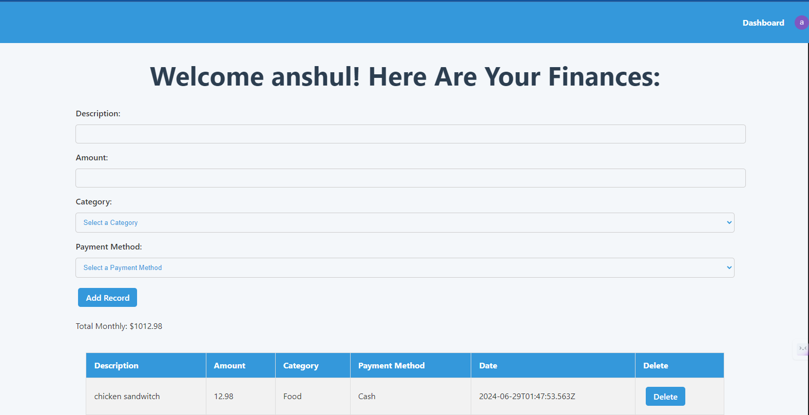
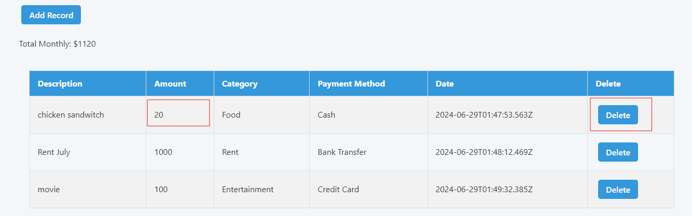
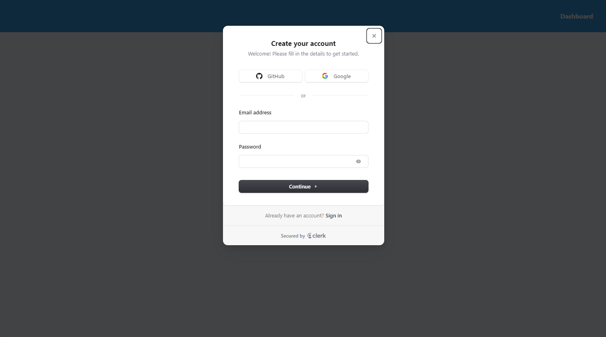
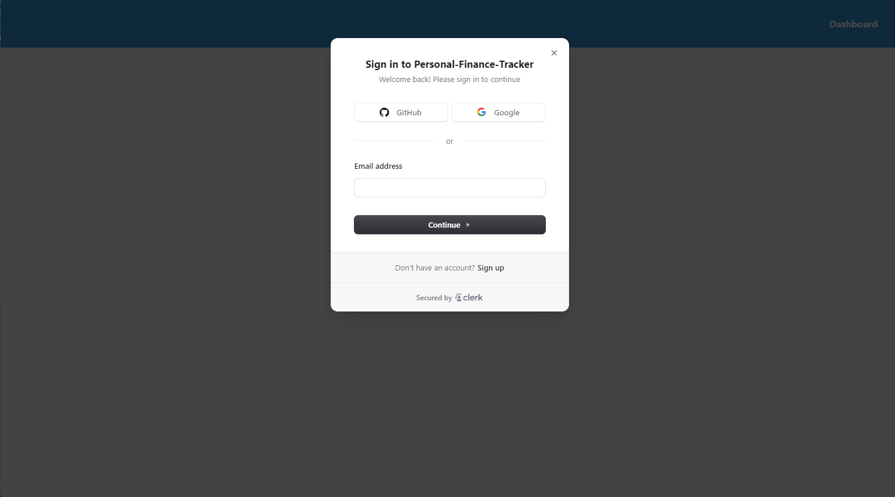
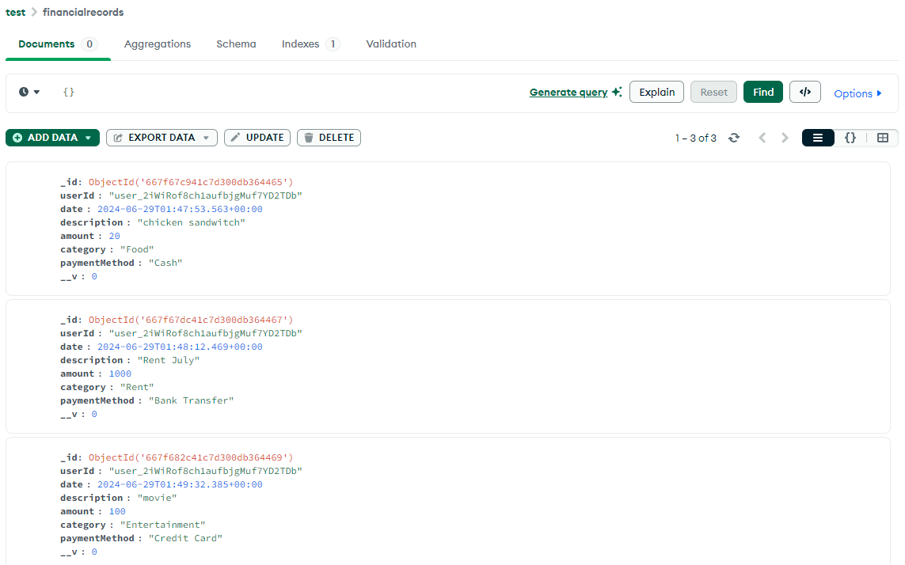

# Finance-Tracker

## Problem Overview

Managing personal finances can be challenging, especially when tracking expenses, incomes, and budgets across multiple categories. Without a proper system, it is easy to lose track of spending and fail to meet financial goals.

## Problem Statement

Many individuals struggle with:
- Keeping track of daily expenses and incomes.
- Categorizing and analyzing spending patterns.
- Setting and adhering to budgets.

The lack of an easy-to-use and accessible personal finance tracking tool exacerbates these issues.

## Technologies Used

MERN Stack 

- **Frontend**: React, TypeScript
- **Backend**: Node.js, Express
- **Database**: MongoDB
- **Styling**: CSS, Bootstrap
- **Authentication**: JWT (JSON Web Tokens), clerk
- **Environment Variables**: dotenv
- **Version Control**: Git, GitHub

## UI Screenshots

### Add Expense


### Update/delete Expense


### Sign Up


### Sign In


### Mongo DB


## Getting Started

### Prerequisites

- Node.js
- npm
- MongoDB

### Installation

1. Clone the repository

2. Install dependencies for both the frontend and backend:
   ```sh
   cd client
   npm install
   cd ../server
   npm install
   ```

3. Set up environment variables:
   Create a `.env.local` file in the server, client directory and from the `.env.local.example`

4. Start the backend server

5. Start the frontend development server
